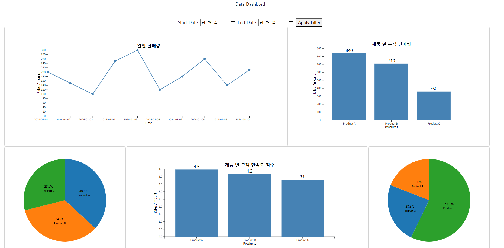
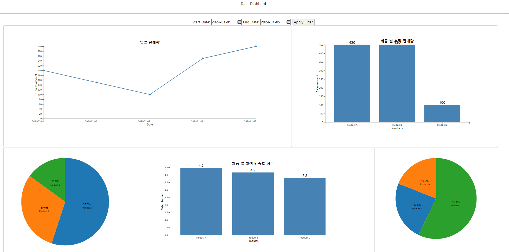

## 판매 데이터 Dashboard 실습
- 판매, 고객 피드백 데이터 대시보드 생성
- Python, Flask, Bootstrap, jQuery, D3 사용
    - Flask: 서버
    - Bootstrap: 레이아웃, UI
    - jQuery: 자바스크립트를 간단하게 사용하도록 지원하는 오픈소스 라이브러리
    - D3: 데이터 시각화

- Dashboard 구조
```bash
static/
    css/
        index.css
    data/
        customer_feedback.csv   # 고객 만족도와 불만사항 데이터
        sales_data.csv          # 제품의 판매량과 반품량 데이터
    js/
        complaintsChart.js          # 고객 불만 사항 시각화
        productChart.js             # 제품 별 누적 판매량 시각화
        returnsChart.js             # 반품량 시각화
        salesChart.js               # 일일 판매량 시각화
        satisfactionScoreChart.js   # 제품 별 고객 만족도 점수 시각화
        updateChart.js              # 날짜 필터링 결과 시각화
    lib/jquery/
        jquery.js

templates/
    index.html

app.py
README.md
requirements.txt
```

## 실행 방법
### 1. 가상환경 생성
```bash
python -m venv venv
```
### 2. 가상환경 활성화
```bash
venv\Scripts\activate
```
### 3. 의존성 설치
```bash
pip install -r requirements.txt
```
### 4. 웹 시스템 실행
```bash
python app.py
```
브라우저에서 `http://localhost:5000`으로 접속하여 시스템을 확인할 수 있다.

## 결과 분석

필터링을 거치지 않은 전체 데이터의 결과이다.  
일일 판매량, 제품 별 누적 판매량, 제품 별 반품 비율, 제품 별 고객 만족도 점수, 제품 별 불만 사항 비율의 시각화를 보여준다.  
  

필터링을 통해 2024-01-01 ~ 2024-01-05 기간 동안의 결과만을 시각화를 통해 확인할 수 있다.